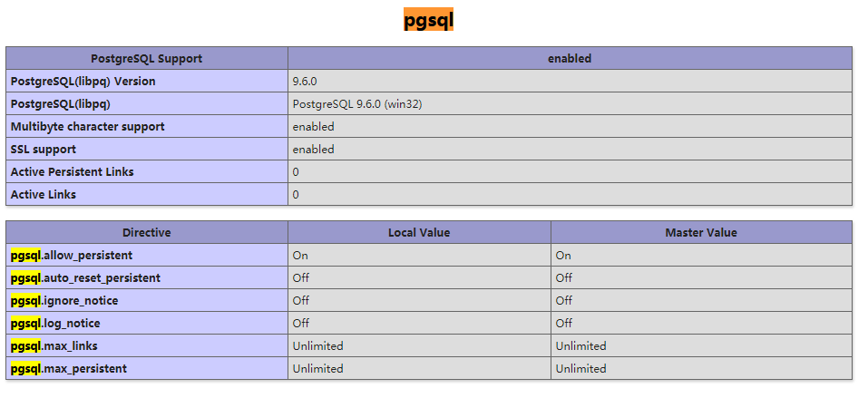

# How To Use PostgreSQL?

 
## 一：使用PHP初探pgsql（环境相关配置） ##

	这里主要对PHP在win下环境做测试

1. win环境下下载pgsql，[LINK](https://www.enterprisedb.com/downloads/postgres-postgresql-downloads "pgsql win下载地址") ，选择pg版本和操作系统下载。next至结尾，会提示安装pgsql工具，可不安装。（此处旨在使用原生sql语句测试）

2.  pgsql默认用户名为：postgres，密码在安装过程中自行设置。

3.  使用PHP连接pgsql前，需要先在php.ini中开启pgsql扩展，搜索并将 **;extension=php_pgsql.dll** 前的分号去掉，重启服务器，使用phpinfo()来查询PHP扩展开启情况，如图所示，则开启。

4. 使用PHP连接数据库，和大多数主流数据库相同，描述host、port。dbname、userinfo信息即可连接数据库。具体连接方式见 link.php

 
## 二：基本操作 ##

	pgsql基础操作，如：切换数据库、数据表，建表等，一切均在dos和web下运行
1. 在dos下连接数据库，如同MySQL：`psql -U postgres -d postgres`，提示用户postgres的口令（即密码）：xxxxxx（TIPS：第一个postgres为用户名）
2. 列出所有数据库：`\i` 
3. 切换数据库：`\c dbname` 
4. 列举表：`\dt` 
5. 查看表结构：`\d tbname`
6. 查看索引：`\di`
7. 建库：`create database [数据库名];`
8. 删库：`drop database [数据库名];`
9. 表的重命名：`alter table [表名A] rename to [表名B];`
10. 删表：`drop table [表名];`
11. 添加字段：`alter table [表名] add column [字段名] [类型];`
12. 删除字段：`alter table [表名] drop column [字段名];`
13. 重命名字段：`alter table [表名] rename column [字段名A] to [字段名B];`
14. 给字段设置默认值：`alter table [表名] alter column [字段名] set default [新的默认值];`
15. 去除默认值：`alter table [表名] alter column [字段名] drop default;`
16. 插入数据：`insert into 表名 ([字段名m],[字段名n],......) values ([列m的值],[列n的值],......);`
17. 修改某列某行：`update [表名] set [目标字段名]=[目标值] where [该行特征];`
18. 删除某行数据：`delete from [表名] where [该行特征];`
19. 删表：`delete from [表名];`
20. 建表：`create table ([字段名1] [类型1] ;,[字段名2] [类型2],......<,primary key (字段名m,字段名n,...)>;);`
21. 创建用户：`createuser username`

